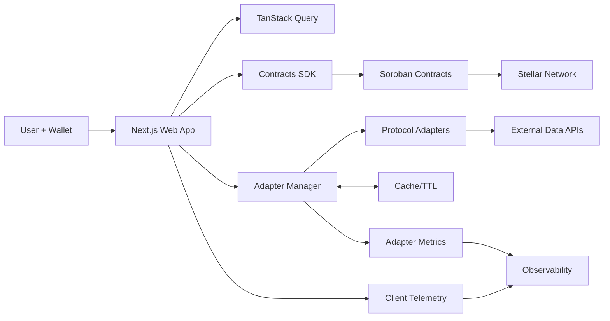

# Reset — Imported Headings Index

## 🗺️ System Flow Diagram

## 🧭 Product Overview

## 🧪 Quality & Coverage Targets

## 🔍 Observability & Incident Response

## 🛡️ Compliance & Threat Model

## 📦 Release Management

## 🏗️ Architecture Overview

### Monorepo Structure

### Technology Stack

## 📦 Package Deep Dive

### 1. `@Reset/contracts` - Smart Contract Layer

### 2. `@adapters/core` - Protocol Integration Layer

### 3. `@shared/core` - Shared Infrastructure

### 4. `web` - Next.js Application

## 🔧 Development Workflow

### Environment Setup

### Build System

### Testing Strategy

## 🚀 Deployment

### Smart Contract Deployment

### Web Application Deployment

## 🔐 Security Considerations

### Smart Contract Security

### Frontend Security

### Data Security

## 📊 Performance Optimization

### Frontend Optimization

### Backend Optimization

## 🔄 Integration Patterns

### Wallet Integration

### Protocol Integration

## 🎯 Roadmap

### Phase A: Stellar Focus ✅

### Phase B: Multi-Chain Expansion 🚧

### Phase C: Advanced Features 📋

## 📸 Screenshots

### Landing Page

### Wallet Integration

#### Wallet Connection

#### Mobile Connection

### Yield Opportunities

#### Opportunities Listing

#### Mock Yield Interface

### Portfolio Management

#### Portfolio Overview

### Real-time Data Analysis

#### Detailed Analytics

#### Advanced Analytics

## 🤝 Contributing

### Development Setup

### Code Standards

### Contribution Workflow

## 📄 License

## 🆘 Support
